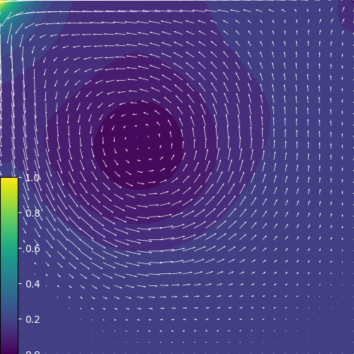

# Pi2D sampple

---
## data
サンプルデータが置かれています。データ、三次元キャビテーフローの圧力(p)と流速(v)のデータです(ただし、側面壁はFree-Slipなので、Z軸方向のどの断面でも流れ場は同じです)。

- cavP.d : 圧力(p), 32x32x32, 単精度
- cavV.d : 流速(v), 32x32x32x3, 単精度

各ファイルは、以下のレコード形式で格納されています。
- FORTRAN書式なしレコード
- 第１レコード: 格子サイズ(integer x 3)
- 第２レコード: データ(p: float x 32 x 32 x 32, v: float x 32 x 32 x 32 x 3)

---
## サンプルプログラム

### C++
C++でのPi2Dサンプルプログラム(Test.cpp)が置かれています。
- コンパイル: make
- 実行: ./Test
- 結果: outimage_000000.png

### C
CでのPi2Dサンプルプログラム(Test.c)が置かれています。
- コンパイル: make
- 実行: ./Test
- 結果: outimage_000000.png

### F90
FORTRAN90でのPi2Dサンプルプログラム(Test.f90)が置かれています。
- コンパイル: make
- 実行: ./Test
- 結果: outimage_000000.png

全てのプログラムで、Z=0のXY断面の圧力と流速ベクトルをプロットしています。
流速ベクトルは(u, v)成分を倍率(vectorMag)5倍で描画しています。

